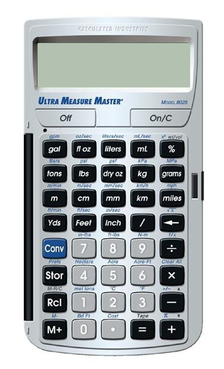

# Calculator
A javascript based simple calculator

# What did I do
Just took an image from Google and crop it's basics buttons, added css to make those piece look like the original image. Removed the screen then added two input fields with background having exactly like a real calculator's screen. Following is the image I took from the internet. I took this image back in Jan, 2017. Now, i can't find an exact reference/url to this image.
 
